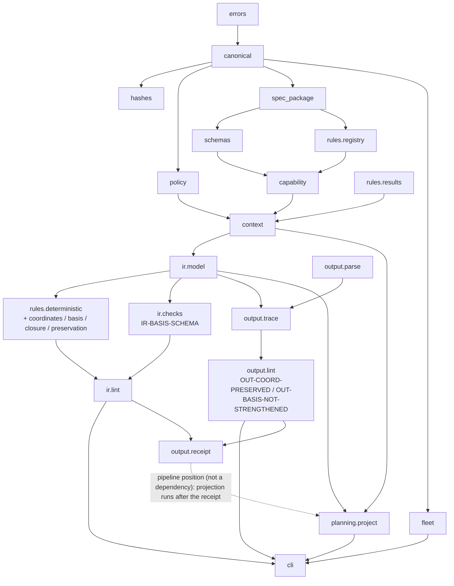

# Architecture

This document describes what exists in `src/ats/` today, how the modules depend on one
another, which pipeline stages actually run, and what the determinism and error contracts
are. Every claim here is checkable against the named file.

ATS-1 — Applied Technical Semantics (ATS) is the technical-state preservation
standard implemented by this repository.

## Top-level separation

The repository keeps five categories of artifact apart, because a code convenience must not
silently alter a normative object or vocabulary.

| Directory | Status | Contents | Write rule |
|---|---|---|---|
| `spec/ATS-1/<version>/` | **Two normative editions** | draft.1: `ATS-1_SPEC.md`, `rules/ats_rules_v1.yaml`, force lexicon, 14 schemas, worked examples, upstream validator. draft.2 (`1.0.0-draft.2/`): amended spec, `rules/ats_rules_v2.yaml` (36 rules, `ats.ruleset.v2`), superset schemas, package-local capability declaration | Draft.1 is the **immutable imported upstream**, byte-verified against its `MANIFEST.json`; the only added file is `IMPORT_RECEIPT.json`. Draft.2 is authored here, sealed by its own `MANIFEST.json`, and treated as immutable once sealed. Both are read only through `ats.spec_package.SpecPackage`. `DEFAULT_SPEC_VERSION` stays `1.0.0-draft.1`; draft.2 is selected explicitly (`Context.load(spec_version="1.0.0-draft.2")` or CLI `--spec-version 1.0.0-draft.2`). |
| `src/ats/` | Executable implementation | Canonicalization, schemas, policy, rules, IR linter, output linter, CLI | Validates, resolves, and reports; never redefines a normative object. |
| `skills/` | Agent-facing constrained workflows | `ats-ir-author`, `ats-assess-output`, `ats-specify-output` | Prose contracts over the same CLI and schemas. See [`SKILL_CONTRACTS.md`](SKILL_CONTRACTS.md). |
| `protocols/` | Corpus and adjudication procedures | Mining, mutation, annotation, adjudication, split policy | Human procedure, versioned as documents. |
| `fixtures/` | Implementation fixtures | Conforming and violating IR, policies, output bundles | Each invalid fixture violates exactly one named thing. |
| `corpus/` | Generated or curated records | Operator registry, seeds | Append-only, content-addressed. See [`CORPUS_DATA_MODEL.md`](CORPUS_DATA_MODEL.md). |
| `capability/` | Machine-readable capability declaration | `ats_rule_capability_v1.json` (repo root: draft.1; draft.2 ships its own inside the package) | **Generated** by `tools/generate_capability.py` from the detector declarations; not hand-maintained (ADR-0009). Resolution order is package-relative `capability/` first, repo root second. |
| `schemas/` | Repository-local schema extensions | Lint reports, output trace, corpus records, fleet policy (`ats.fleet_policy.v1`), planning projection (`ats.planning_projection.v1`) | Namespaced `$id`s that may not shadow a normative id (ADR-0003). |
| `docs/` | Architecture, decisions, operator documentation | This file and its siblings | — |

## Operational position

ATS is **operational infrastructure**, not a research-only artifact:
production use is a future evidence source, while internal annotation material is
omitted from the public distribution and is not public evidence. The architecture
below embodies these positions directly: style rules are `ADVISORY` and never block a
build (§3); semantic recovery and inspectability are primary, so the lint surface enforces
protected relations, coordinates, and basis rather than brevity (§4, §5); ATS owns semantic
compilation and conformance evidence — IR validation, deterministic lint, receipts,
projection — and nothing else, so no module here is a workflow engine or execution
authority (§8); ATS artifacts are privileged planning inputs, never automatically
executable task graphs (§9); and learned semantic checking stays advisory/deferred, with
no detector trained on its own renderer's output (§10). The normative package,
policy contract, and planning projection remain the public references for these
surfaces.

## Module map

Each module has one responsibility. The dependency direction is strictly downward in the
table: a module may import from rows above it and never from rows below.

| Module | Single responsibility | Imports (internal) |
|---|---|---|
| `ats/__init__.py` | Implementation identity: `__version__`, `IMPLEMENTATION_NAME` | — |
| `ats/errors.py` | The typed error hierarchy and its exit codes | — |
| `ats/rules/results.py` | Result vocabulary, detector identity, findings, and `decide()` — the never-PASS-by-absence gate | — |
| `ats/canonical.py` | RFC 8785 canonical JSON, SHA-256 content addressing, sealing and seal verification | `errors` |
| `ats/hashes.py` | Source binding: content hash, normalized hash, normalization procedure, offset map | `canonical`, `errors` |
| `ats/policy.py` | Pure policy resolution over the rule-state lattice, exceptions, and typed conflicts | `canonical`, `errors` |
| `ats/spec_package.py` | Read-only view over one normative edition — the imported draft.1 upstream or the authored draft.2 package — plus manifest integrity. `DEFAULT_SPEC_VERSION` stays `1.0.0-draft.1`; draft.2 loads by explicit version. The ruleset filename is per edition (`ats_rules_v1.yaml` vs `ats_rules_v2.yaml`); the registry never hardcodes it | `canonical`, `errors`, `hashes` |
| `ats/spec_import.py` | Archive extraction, upstream-validator execution, import receipt, re-verification | `canonical`, `errors`, `hashes`, `spec_package` |
| `ats/schemas.py` | Resolved Draft 2020-12 registry over normative + local schemas; validation by `schema_version` | `canonical`, `errors`, `spec_package` |
| `ats/rules/registry.py` | Typed index over the edition's ruleset (`ats_rules_v1.yaml` in draft.1, `ats_rules_v2.yaml` in draft.2) and `ats_force_lexicon_v1.yaml`; `DETECTOR_CLASS_MAX_AUTHORITY` | `errors`, `spec_package` |
| `ats/capability.py` | Load, coherence-check, and project the per-rule capability declaration | `canonical`, `errors`, `rules.registry`, `schemas`, `spec_package` |
| `ats/context.py` | The one resolved evaluation context handed to every subsystem; detector-identity factory. Dual-edition: `Context.load()` defaults to draft.1's 30-rule edition, `spec_version="1.0.0-draft.2"` selects the explicit 36-rule edition | `canonical`, `capability`, `errors`, `policy`, `rules.registry`, `rules.results`, `schemas`, `spec_package` |
| `ats/ir/model.py` | Typed indexed *views* over a validated TextIR document; deterministic finding identity | `canonical`, `context`, `errors`, `policy`, `rules.results` |
| `ats/ir/validate.py` | TextIR schema validation and the unknown-major-version refusal | `context`, `errors`, `model` |
| `ats/ir/references.py` | Cross-object reference resolution the schema cannot express | `model` |
| `ats/ir/profile.py` | ASSESS/SPECIFY profile-slot completeness (`IR-PROFILE-SLOTS`) | `model`, `rules.results` |
| `ats/rules/deterministic/_support.py` | `DetectorSpec` — the one declaration that drives runtime authority, the capability document, and each finding's authority | `ir.model`, `rules.registry`, `rules.results` |
| `ats/rules/deterministic/*.py` | One module per rule family; each detector body returns findings + subcheck records. Draft.2 adds `coordinates.py` (ATS-COORD-001/002), `basis.py` (ATS-BASIS-001/002), `closure.py` (ATS-CLOSE-001), and `ATS-PRES-003` in `preservation.py` | `_support`, `ir.model`, `rules.results` |
| `ats/ir/checks.py` | The 27 structural IR checks (26 draft.1 + `IR-BASIS-SCHEMA`; `IR-ID-UNIQUE` and `IR-REFS` extended in place to cover stable-coordinate ids and `dependency_target` / `acceptance_criterion_id` refs) | `canonical`, `capability`, `context`, `errors`, `hashes`, `model`, `policy`, `profile`, `references`, `rules.deterministic.requirements`, `rules.registry`, `rules.results` |
| `ats/ir/lint.py` | Orchestrates the IR surface: validate → resolve → check → run detectors → conformance → sealed report | `canonical`, `checks`, `context`, `errors`, `model`, `policy`, `rules.deterministic`, `rules.results`, `validate` |
| `ats/output/parse.py` | CommonMark parsing (markdown-it-py), block model, `<!-- ats:block -->` markers, unsupported-construct reporting | `errors` |
| `ats/output/trace.py` | Trace sidecar: reading, block hashing, building, JSON-Pointer resolution into the IR | `canonical`, `context`, `errors`, `ir.model`, `parse` |
| `ats/output/render_checks.py` | The 8 deterministic surface checks over rendered prose | `context`, `ir.model`, `parse`, `rules.deterministic._support`, `rules.deterministic.terminology`, `rules.deterministic.time_rules`, `trace` |
| `ats/output/receipt.py` | Candidate-receipt construction and receipt verification; the `SELF_IDENTITIES` refusal | `canonical`, `context`, `errors`, `ir.model`, `policy` |
| `ats/output/lint.py` | Orchestrates the output surface: 27 checks over bytes, trace, IR, policy, and optional receipt. Draft.2 adds `OUT-COORD-PRESERVED` and `OUT-BASIS-NOT-STRENGTHENED`, gated into the mechanical dimension only when the IR declares the surfaces they protect (`GATED_MECHANICAL_CHECKS`) | `canonical`, `context`, `errors`, `hashes`, `ir.model`, `ir.validate`, `parse`, `policy`, `receipt`, `render_checks`, `rules.results`, `trace` |
| `ats/fleet.py` | Fleet artifact policy resolution (draft.2 D-G): validates `ats.fleet_policy.v1`, content-binds `policy_id`, resolves applicability per artifact class with repository overrides and default exclusions; drives `ats policy resolve` | `canonical`, `errors`, `spec_package` |
| `ats/planning/project.py` | Deterministic planning projection (draft.2 D-H): `project_from_ir` turns one validated TextIR + bound policy + artifact hash into a sealed `ats.planning_projection.v1`; drives `ats planning project` | `canonical`, `context`, `errors`, `ir.model`, `ir.validate` |
| `ats/corpus/` | Corpus inventory, mining, mutation, annotation, adjudication, splitting | see [`CORPUS_DATA_MODEL.md`](CORPUS_DATA_MODEL.md) |
| `ats/cli.py` | Argument parsing, output formatting, and the error-to-exit-code boundary | the modules above |

Two structural consequences of that direction are worth naming:

- **`rules/results.py` imports nothing.** The honesty gate has no dependencies, so it cannot
  be bypassed by a module that happens to sit closer to the data.
- **`context.py` is the only aggregator.** Every subsystem takes a `Context` rather than
  reaching for module-level globals, so a test can point the whole stack at a different
  package version without patching module state.



The two draft.2 detector families sit inside the lint stage: `coordinates.py`,
`basis.py`, and `closure.py` register into `rules.deterministic` and run from
`ir.lint`, and the extended `IR-*` checks run from `ir.checks`. The planning
projection is a separate surface that consumes the validated IR and the bound
policy snapshot after the receipt is emitted (see [Operational surfaces](#operational-surfaces-draft2)).

## Evaluation pipeline

Spec §14.1 fixes the stage order. A stage MAY be skipped only when it is not applicable or
the capability declaration says it is unsupported, and **a skipped required stage produces
`UNAVAILABLE`**. This is what each stage does here.

| §14.1 stage | Status in v0 | Where | If skipped, what is reported |
|---|---|---|---|
| source acquisition | Implemented | `ats.hashes.bind_file` / `bind_text`; `IR-SOURCE-HASH` | When no source file is supplied to `ats ir lint`, `IR-SOURCE-HASH` is `UNAVAILABLE` — the declared hash is well formed but its binding to actual bytes is unverified (§14.2). |
| policy resolution | Implemented | `ats.policy.PolicySnapshot.resolve_all`; `IR-POLICY-IDENTITY`, `IR-POLICY-CURRENTNESS` | `StalePolicyError` (exit 4). Currentness failure fails closed for required claims (§14.3). |
| profile resolution | Implemented | `ats.ir.profile.evaluate_profiles`; `IR-SECTION-PROFILE`, `IR-PROFILE-SLOTS` | A section whose profile is outside `ASSESS`/`SPECIFY` yields `UNAVAILABLE` rather than being coerced (§9.5). |
| parse and source mapping | Implemented on the output surface only | `ats.output.parse` (markdown-it-py CommonMark) | On the IR surface there is no source text to parse, so rules whose `required_inputs` include `source_text`, `syntax`, or `document_ast` report `UNAVAILABLE` with the missing input named. On the output surface, a parse failure marks `OUT-MARKDOWN-PARSE` `FAIL` and every surface check `UNAVAILABLE` — never a silent token-only pass (§14.4). |
| meaning-ledger extraction or validation | **Validation only** | `ats.ir.validate.validate_ir` | Extraction from legacy prose is not implemented in Python; it is the IR-authoring skill's job (§14.5). The linter validates a supplied ledger and never reconstructs one. |
| deterministic checks | Implemented | `ats.ir.checks` (27 checks) + `ats.rules.deterministic` (30 rule results in draft.1, 36 in draft.2) + `ats.output.lint` (27 checks) | Each check reports its own status; none reports `PASS` because nothing was inspected. |
| candidate-rule retrieval | **Skipped — no D2 router** | — | Declared in `ats.capability.KNOWN_LIMITATIONS`. No rule is ever marked applicable by retrieval, so nothing downstream depends on it; §14.7 makes retrieval candidate generation only, and its absence removes candidates rather than evidence. |
| semantic criticism | **Skipped — no D3 critic** | — | `semantic_review` is `UNAVAILABLE` in every report. §16.5 states that the absence of a proposal-only finding is not evidence that a required semantic predicate passed, so a missing critic cannot be read as a clean result. |
| finding ranking and budgeting | **Not applied** | `PolicySnapshot.finding_budget` exposes the snapshot's declared budget; no stage truncates or ranks | Every finding is reported. This over-reports relative to §12.6 rather than under-reporting, and §15.3 requires the budget and ranking policy to be *recorded* for `semantic_review: PASS` — a dimension this build never passes. |
| adjudication | **External by design** | `OUT-FINDING-DISPOSITIONS` reads a supplied receipt | With no receipt, the check is `UNAVAILABLE` ("no disposition record exists to check"). Nothing in this package may disposition its own finding (§13.7). |
| bounded repair | **Not implemented** | — | No autofix class is declared: `to_normative()` emits `autofix_classes: []` and downgrades an unimplemented rule's autofix to `none`. |
| preservation verification | **Partial (draft.2)** | `ATS-PRES-001`, `ATS-PRES-002` are `undecidable`; `ATS-PRES-003` (draft.2 D-B) `DECIDES` protected-relation retention when the source IR carries an output trace, else `UNAVAILABLE` | `preservation` is `NOT_APPLICABLE` when no TRANSFORM profile is active, and `UNAVAILABLE` when it is. §6.4 makes both PRES-001/002 unwaivable, so `preservation: PASS` is still unreachable; PRES-003 contributes a decided rule result on the trace surface without changing the dimension's status. `OUT-COORD-PRESERVED` and `OUT-BASIS-NOT-STRENGTHENED` cover the coordinate and basis halves of the transformation surface on the output side. |
| conformance evaluation | Implemented | `ats.ir.lint.compute_conformance`, `ats.output.lint._compute_conformance` | Five dimensions computed independently; nothing averaged (§5.2, §15.6). Each carries a non-empty `conformance_rationale` string. |
| receipt emission | Implemented as **candidate** | `ats.output.receipt.build_candidate_receipt` | The receipt records what the deterministic stack established and names an external adjudicator. It does not assert that acceptance happened. |

### Operational surfaces (draft.2)

The two draft.2 operational surfaces sit outside the §14.1 stage list but inside the
artifact flow, and both are deterministic.

**Fleet artifact policy (D-G) — `ats policy resolve <artifact-class> [--repo <path>]`.**
`ats.fleet.FleetPolicy.from_document` validates `config/policies/fleet_policy.json` against
`ats_fleet_policy_v1.schema.json`, content-binds `policy_id` (a mismatch raises
`StalePolicyError`), and resolves one artifact class to its effective `required_for`
membership, enforcement set, and failure policy, folding in per-repository overrides.
The checked-in default is a host-neutral draft.2 authoring policy with no repository
overrides or deployment-specific receipt bindings. A fleet or repository-specific
deployment MAY pass an explicit policy document to opt into its own override registry;
that context is not implicit in the public default. Applicability is by artifact
intent/policy, never inferred from filename alone — the schema records an
`applicability_basis` per entry. The resolution is a pure function of the policy
document and the class, so it is replayable and `policy_id`-bindable. A policy consumer
resolves and enforces this document; ATS only computes what it is asked to resolve
(ADR-0017).

**Planning projection (D-H) — `ats planning project <ir> --policy <policy> --artifact-sha256 <sha>`.**
`ats.planning.project.project_from_ir` validates the IR with the same machinery `ats ir
lint` uses, binds the policy snapshot's currentness, and projects the document into a
sealed `ats.planning_projection.v1`: requirements, decisions, acceptance criteria, proof
obligations, dependencies, non-goals, boundaries, exceptions, update indicators, authority,
and the document's `stable_coordinates` — every entry carrying its IR source pointer. The
projection binds `artifact_sha256` + `ir_sha256` + `policy_snapshot_sha256`, is validated
against the projection schema, and is sealed (`projection_id` is the content hash of
everything else). It runs after receipt emission in the artifact flow and is the
surface downstream planners consume without re-authoring (`ATS-valid ≠
sufficiently specified for planning ≠ accepted`; see
[`PLANNING_PROJECTION.md`](PLANNING_PROJECTION.md)).

Both surfaces pin draft.2 explicitly: fleet policy and capstones select
`spec_version: 1.0.0-draft.2`, and every projection stamps `spec_version` so receipts and
projections stay bindable.

### Observed shape of a clean run

Running `lint_ir` over `fixtures/ir/valid/assess_conforming.json` with
`fixtures/policies/assess.json` and its source file — under the default draft.1 edition —
produces 26 structural checks, 30 rule results, and:

```text
mechanical: PASS   (12 conformance-evidence rules, 15 structural checks)
profile: PASS
semantic_review: UNAVAILABLE
preservation: NOT_APPLICABLE
forecast_calibration: INSUFFICIENT_EVIDENCE
```

A conforming artifact does **not** produce an all-`PASS` vector, and that is the intended
result. Eleven rules report `REVIEW_REQUIRED` because their detectors recognise only a subset
of violations; five report `UNAVAILABLE` because the TextIR surface cannot supply
`source_text`, `syntax`, `document_ast`, or `document_context`; and five report
`NOT_APPLICABLE` because the three SPECIFY-only requirement rules and the two preservation
rules resolve to `disabled` under an ASSESS policy.

**The draft.2 edition changes the counts, not the shape.** The same fixture under
`Context.load(spec_version="1.0.0-draft.2")` (CLI `--spec-version 1.0.0-draft.2`) runs 27
structural checks and 36 rule results. All six new rules default to `advisory` under ASSESS
(`ATS-COORD-001/002`, `ATS-BASIS-001`, `ATS-BASIS-002`, `ATS-PRES-003`, `ATS-CLOSE-001`
— §12.7.5), so under the ASSESS-only policy they resolve to `disabled` and report
`NOT_APPLICABLE`; the run shape above is unchanged. Under a SPECIFY or TRANSFORM policy they
engage: `ATS-COORD-001/002`, `ATS-BASIS-002`, and `ATS-PRES-003` are D1 `DECIDES` rules
(`PASS` on clean, `FAIL` on a decided violation), while `ATS-BASIS-001` (D3) and
`ATS-CLOSE-001` (D1) are `DETECTS_VIOLATIONS` rules that report `REVIEW_REQUIRED` on a
clean run — never `PASS` by absence.

## Determinism contract

| Property | Mechanism | File |
|---|---|---|
| Canonical serialization | RFC 8785 JCS delegated to the `rfc8785` library, never hand-rolled (ADR-0004) | `ats/canonical.py::canonical_bytes` |
| Content addressing | `content_hash(obj)` removes the object's own hash field (per `SELF_HASH_FIELDS`, keyed by `schema_version`), JCS-serializes the remainder, and SHA-256s it — Appendix C steps 1–4 | `ats/canonical.py` |
| Sealing | `seal(obj)` writes the address into the declared self-hash field and *raises* rather than silently producing an unaddressed artifact when the schema declares none | `ats/canonical.py::seal` |
| Replay verification | `verify_seal(obj)` returns `(ok, declared, recomputed)`; `IR-CANONICAL` re-round-trips the IR and reproduces its content address | `ats/canonical.py`, `ats/ir/checks.py::_ir_canonical` |
| Source normalization | NFC per character, CRLF/CR → LF, trailing horizontal whitespace stripped per line, with a monotone offset map back to source positions. `NORMALIZATION_VERSION` must be bumped if the procedure changes, because previously recorded normalized hashes stop being reproducible | `ats/hashes.py` |
| Block hashing | SHA-256 over the block body's exact UTF-8 bytes with the marker line excluded and one trailing newline stripped, so a block's hash does not change when it becomes the last block | `ats/output/trace.py::block_text_sha256` |
| Deterministic finding identity | `artifact_id:rule_id:issue_code:ordinal` where `ordinal` is a zero-padded three-digit counter per `(rule_id, issue_code)` within the run — never a clock or a UUID (§16.2, ADR-0007) | `ats/ir/model.py::IrEvaluation.finding_id` |
| No clock reads inside evaluation | Evaluation time enters once, through `Context.load(now=...)`, and is read as `ctx.now` / `ctx.timestamp()`. Policy expiry and report timestamps both use it | `ats/context.py`, `ats/policy.py` |
| No network | The only subprocess this package spawns is the imported package's own offline validator, run from the package directory with a fixed argv and no shell | `ats/spec_import.py::run_package_validator` |
| Parser identity recorded | Every output report carries `parser_version()` = `markdown-it-py/commonmark@<version>`, so a parser change invalidates a prior receipt's replay claim (§15.8) | `ats/output/parse.py` |
| Schema-set identity recorded | `Context.schema_set_sha256` content-addresses every schema in play, normative and local, and rides on every IR lint report | `ats/context.py` |
| Fleet policy binding | `policy_id` is the content hash of the fleet-policy document with its own `policy_id` field omitted; `FleetPolicy.from_document` raises `StalePolicyError` on mismatch, and every resolution records the `basis` that decided it (`text_policy` / `repository_override` / `default_exclusion`) | `ats/fleet.py` |
| Projection sealing | `project_from_ir` validates against `ats_planning_projection_v1.schema.json` and seals: `projection_id` is the content hash of everything else, and the projection binds `artifact_sha256`, `ir_sha256`, and `policy_snapshot_sha256` | `ats/planning/project.py` |

Determinism is also what makes the honesty rule enforceable: because a finding's identity is
a function of its inputs, "no finding this run" is a reproducible fact about the detector's
coverage rather than a scheduling accident.

## Error taxonomy and exit codes

Every failure path raises a member of the `ats.errors` hierarchy; no path degrades to a bare
`Exception` or to a silently weaker result (§20.6). `ats.cli` catches `AtsError` at the
boundary, emits `exc.payload()` to stderr, and returns `exc.exit_code`.

| Exception | `code` | Exit | Raised when |
|---|---|---|---|
| `AtsError` | `ats_error` | 1 | Base class. |
| `UsageError` | `usage_error` | **2** | Arguments or files that cannot be interpreted: unreadable path, non-UTF-8 JSON, unknown rule id, unknown schema id, unknown `schema_version`, a detector class that may not carry the requested authority, an incoherent capability declaration. |
| `UnsupportedCapabilityError` | `unsupported_capability` | **3** | A requested capability is declared unsupported. Its payload carries `status: "UNAVAILABLE"` and the declaring location, because §5.5 and §14.12 require the unavailable capability to be reported, never emulated by a weaker component holding the same claim. |
| `RequiredCheckUnavailableError` | `required_check_unavailable` | **4** | A required check could not execute — `UNAVAILABLE`, not `PASS` (§5.4). |
| `StalePolicyError` | `stale_policy` | **4** | Policy currentness could not be established: declared `snapshot_sha256` does not match the canonical bytes, or the snapshot targets a different spec version (§14.3, §6.6). |
| `SchemaValidationError` | `schema_validation_failed` | 1 | An object failed its JSON Schema. Carries every `SchemaViolation` (JSON Pointer, message, validator), not just the first. |
| `PackageIntegrityError` | `package_integrity_failed` | 1 | The imported package does not match its manifest, or the import is unreceipted. |
| `PolicyResolutionError` | `policy_resolution_failed` | 1 | Resolution failed or produced typed `PolicyConflict`s. §6.5 forbids selecting a conflict winner by heuristic probability, so the conflict is returned typed rather than resolved. |
| `ParseError` | `parse_failed` | 1 | A parser failed and identified the affected region (`locator`, `line`) per §14.4. |
| `ReferenceError_` | `dangling_reference` | 1 | An internal reference in an ATS object does not resolve. |

The CLI also derives an exit code from a conformance vector, in `cli._exit_for`:

```text
0  clean
1  any dimension is FAIL
4  any of mechanical | profile | preservation is UNAVAILABLE
```

`semantic_review` and `forecast_calibration` are excluded from the exit code because this
build can never move them: they are structurally `UNAVAILABLE` and
`INSUFFICIENT_EVIDENCE` respectively (ADR-0005). Including them would make every run exit
non-zero and would train operators to ignore the code. They remain fully visible in the
reported vector — the compact status line may be reduced, the vector may not (§15.6).

## Constitution notes

- **#5 (single source of truth).** Three things could have drifted apart: what a detector may
  conclude at runtime, what the capability document says it may conclude, and what authority
  its findings carry. One `DetectorSpec` per rule drives all three, and
  `tools/generate_capability.py` regenerates the document from those specs.
- **#3 (typestate encodes invariants).** Python cannot make an illegal authority a compile
  error, so the invariant is pushed to the narrowest possible runtime chokepoint instead:
  `Context.detector()` refuses to construct a `Detector` claiming `conformance_evidence` for
  a class whose ceiling forbids it, and `decide()` is the only constructor detectors use.
  That is weaker than a type; it is named as a tension rather than claimed as compliance.
- **#25 (complexity must pay rent).** `ir/checks.py` is a long module of small functions
  rather than a class hierarchy, because each check is independent and the flat list in
  `run_structural_checks` is the entire control flow. Splitting it would add indirection
  without removing a failure mode.
- **#12 (front-load free structural context).** `Context` computes the package, schemas,
  registry, lexicon, and capability once and hands them down, rather than each subsystem
  rediscovering them.
