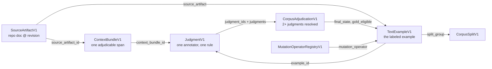

# Corpus data model

The ATS corpus supports rule definition, deterministic fixtures, semantic-detector training,
rule retrieval, hard-negative evaluation, repair evaluation, preservation testing, and rule
promotion (§17.1). It is **not** a collection of "good" and "bad" prose, and the data model is
shaped to make that confusion mechanically difficult.

Every field table below is read from the schema file named in its heading. The schemas are
authoritative; this document is a navigable projection over them.

## The five corpus objects



Read the graph as a claim-strength ladder. A `SourceArtifactV1` asserts only *this document
existed at this revision with these bytes*. A `ContextBundleV1` asserts *this span, with
enough surrounding material to adjudicate it*. A `TextExampleV1` carries a label. A
`JudgmentV1` says *one annotator, judging one rule, assigned that label for this reason*. A
`CorpusAdjudicationV1` says *two or more independent judgments were resolved, and here is
what the disagreement was*. Nothing at a lower rung may be promoted to a higher one by
inference — most importantly, `review_state: accepted` on a source artifact is not a
`conforming` label, and the schema keeps them in different objects so the two cannot be
confused.

A second ladder runs alongside it, and it is shorter than people expect. Git can establish
that a document existed at a revision, that it was later modified or deleted, that one commit
descends from another, and that a merge joined two lines of history. It cannot establish that
anybody accepted the text. Acceptance is a decision, and decisions live in artifacts an
authority produced — see [Acceptance is a decision, not a topology](#acceptance-is-a-decision-not-a-topology).

Two supporting registries sit beside the five: `MutationOperatorRegistryV1` declares what a
synthetic mutation may do, and `CorpusSplitV1` records a generated leakage-grouped split.

---

## `SourceArtifactV1` — `schemas/ats_source_artifact_v1.schema.json`

> A content-addressed repository document at an exact revision. Corpus mining never labels
> text whose source revision is not pinned here.

| Field | Req | Type | Notes |
|---|:--:|---|---|
| `schema_version` | Y | const `ats.source_artifact.v1` | |
| `artifact_id` | Y | `identifier` | |
| `record_sha256` | · | `sha256` | Self-hash field; `content_hash` omits it (Appendix C step 1) |
| `repository` | Y | `string` | |
| `repository_group` | Y | `string` | Leakage grouping key: repositories sharing a template or owner share a group. |
| `path` | Y | `string` | |
| `revision` | Y | `string` | |
| `content_sha256` | Y | `sha256` | |
| `normalized_sha256` | Y | `sha256` | Separate from `content_sha256`; normalization never replaces the source hash (Appendix C) |
| `bytes` | · | `integer` | |
| `media_type` | Y | `string` | |
| `author_provenance` | · | object (`availability` required) | `author`, `authored_at`, `committer` |
| `model_provenance` | · | object (`availability` required) | `model` (`model_artifact`), `evidence`, `authorship` |
| `model_provenance.authorship` | · | object (`value`, `perspective`, `inference_policy`, `searched`, `evidence` required) | `value` is `human` \| `model` \| `mixed` \| `unknown`; `unknown` is the default and the only value reachable without an explicit declaration. `searched` is never empty, so `unknown` is distinguishable from "never looked" (§17.4, ADR-0002). |
| `review_state` | Y | `accepted` \| `rejected` \| `superseded` \| `reverted` \| `draft` \| `unknown` | What the repository declared, or what Git shows. Kept distinct per spec §17.4; merged prose is not assumed conforming, and is not assumed accepted either. Not the same field as `acceptance_state` below. |
| `acceptance_evidence` | · | object (`availability` required) | `locator`, `reviewers`, `notes`. Locally available review *commentary*. A `Reviewed-By` trailer records that somebody looked, never what they decided. |
| `use_authority` | Y | `internal_only` \| `internal_training_permitted` \| `external_training_permitted` \| `unknown` \| `prohibited` | §17.13 |
| `handling_policy` | Y | `public` \| `internal` \| `confidential` \| `restricted` | Inherited by derived records |
| `template_family` | · | `string` | Leakage dimension |
| `near_duplicate_cluster` | · | `string` | Leakage dimension |
| `domain` | · | `string` | Leakage dimension |
| `profile_hypotheses` | · | array of `profile` | Hypotheses, not assignments |
| `heading_paths` | · | array of array of `string` | |
| `ingested_at` | Y | `timestamp` | |
| `extensions` | · | object | |

Three required fields do most of the governance work. `revision` makes the record pinned, so
a later edit produces a *new* artifact rather than mutating the old one. `use_authority` and
`handling_policy` are required rather than optional because §17.13 makes training data record
its use authority and makes derived embeddings, labels, and mutations inherit the source's
handling policy — a field that can be omitted is a field that gets omitted.

### Acceptance is a decision, not a topology

`ats.corpus.acceptance` reads an `acceptance_state` for a document: `accepted`, `rejected`,
`superseded`, or `unknown`. `unknown` is the default and the only value reachable without an
authoritative artifact, and `Acceptance.__post_init__` refuses to construct any other state
with an empty evidence list — the same structural guarantee `Authorship` gives for authorship,
deliberately in the same shape rather than a second mechanism.

`rejected` and `unknown` are distinct and stay distinct. `rejected` is a refusal an authority
made about the text; `unknown` is the absence of a sufficient decision. Collapsing them would
lose the difference between "somebody said no" and "nobody has said anything", which is
exactly the distinction ADR-0002 exists to protect.

| Evidence kind | What it is |
|---|---|
| `arq_receipt` | A conformance receipt from the Arq adjudication path the pipeline ends in. A *candidate* receipt is not one: §14.11 leaves it deliberately short of acceptance. |
| `decision_record` | An ADR, governance minute, or signed approval naming the document and stating what was decided. |
| `review_disposition` | A structured review outcome carrying the reviewer and the decision. |
| `review_state_declaration` | An `ATS-Review-State` trailer or git note. Admitted because somebody wrote it on purpose — a declaration that happens to live in Git, not something Git computed. |

Each evidence record carries the state, a locator, and the deciding authority. An authority
that names this implementation is refused outright, reusing
`ats.output.receipt.SELF_IDENTITIES`: §13.7 forbids a component from adjudicating its own
findings and §14.11 puts semantic acceptance with an authorised human or a governed external
system.

The signals below are the ones Git *can* answer, and they are the ones a plausible
implementation would promote on. They are observed and reported — an annotator needs them —
on `Acceptance.topology`, structurally apart from `Acceptance.evidence`, each carrying the
reason it establishes nothing: `merge_topology`, `default_branch_presence`,
`survival_duration`, `deletion`, `revert_marker`, `later_edit_absence`,
`reviewed_by_trailer`, `candidate_receipt`. A merged document is not accepted; a deleted
document is not rejected.

`reverted` is the sharpest case. Git's own `This reverts commit` line makes it
detectable, but a revert says only that a change was undone. It does not say a
reviewer rejected the prose, so it is recorded as topology rather than as an
acceptance state. Acceptance is therefore not a required stratum of a sampling
frame (`ATS_CORPUS_PROTOCOL_V0.md` CP-30.1). If a frame requests acceptance
coverage without an authoritative record, it records `expectation_withdrawn` or
`unavailable`; it MUST NOT infer acceptance from repository topology. Private
corpus distributions and their measurements are outside this public model.

### The prospective binding

Everything above is retrospective: what an existing document declares, and what an authority
recorded about it. `ats.corpus.authorship` keeps a second, forward-looking half for artifacts
*this* system produces, and the separation is enforced rather than described.

A `ProspectiveBinding` carries seven fields, none optional: the producing skill, the model
name and version where a model applies, the prompt or instruction identity, the source IR, the
human edits, the adjudicator, and the acceptance receipt. Not one of them survives the
artifact — the prompt is gone, the IR is a separate document, a human's edit is
indistinguishable from the model's sentence once both are prose, and the adjudicator was never
written down. A field with no value carries an explicit token (`not_applicable`, `none`,
`not_yet_adjudicated`, `not_yet_accepted`) so "there was no model" stays distinguishable from
"nobody recorded the model".

`Authorship` refuses a binding on a `retrospective` reading and refuses a `prospective`
reading without one, so the producer policy has no path by which it reaches a document that
predates it, and a producer has no path by which it ships an incomplete record.
`read_authorship` never constructs a binding at all. The binding is written once, into the
producer's declaration; the artifact's `model_provenance.authorship` cites that declaration by
locator instead of copying it, so the seven facts have exactly one place they can be wrong.
`ats.corpus.acceptance.producer_binding_acceptance` is where the two models meet: a binding
naming both an adjudicator and a receipt promotes to `accepted`; while either is pending the
artifact is `unknown`, because producing something is not accepting it.

## `ContextBundleV1` — `schemas/ats_context_bundle_v1.schema.json`

> The minimum context needed to adjudicate one candidate span. Spec §17.4: an isolated
> sentence SHOULD NOT be labeled when the rule depends on discarded context, so every field
> here is either present or explicitly typed as unavailable.

| Field | Req | Type | Notes |
|---|:--:|---|---|
| `schema_version` | Y | const `ats.context_bundle.v1` | |
| `bundle_id` | Y | `identifier` | |
| `record_sha256` | · | `sha256` | Self-hash field |
| `source_artifact_id` | Y | `identifier` | |
| `source_revision` | Y | `string` | |
| `source_span` | Y | `span` | |
| `span_text` | Y | `string` | |
| `containing_block` | Y | object (`kind`, `text`, `span` required) | `kind` ∈ `paragraph` \| `list` \| `list_item` \| `table` \| `code_block` \| `block_quote` \| `heading` |
| `heading_path` | Y | array of `string` | |
| `preceding_context` | Y | `optional_text` | |
| `following_context` | Y | `optional_text` | |
| `local_definitions` | Y | array of object (`term`, `definition`, `locator` required) | |
| `glossary_entries` | Y | array of `glossary_entry` | |
| `profile_hypothesis` | Y | object (`profile`, `basis` required) | `basis` ∈ `heading_path` \| `declared_front_matter` \| `path_convention` \| `annotator_supplied` \| `unknown`; optional `alternatives` |
| `policy_context` | Y | object (`availability` required) | `policy_snapshot_id`, `policy_sha256` |
| `diff` | Y | `optional_text` | |
| `review_comment` | Y | `optional_text` | |
| `later_edit` | Y | `optional_text` | |
| `reversal` | · | `optional_text` | |
| `context_completeness` | · | `complete` \| `partial` \| `insufficient` | An annotator MUST be able to see that context was truncated. |
| `extensions` | · | object | |

The `optional_text` local `$def` is the mechanism that turns §17.4's "SHOULD preserve" into
something checkable. It requires an `availability` from the normative enum — `present`,
`not_found`, `not_searched`, `unavailable`, `withheld`, `not_applicable` — and a conditional
subschema makes `text` mandatory when `availability` is `present`. So `diff`,
`review_comment`, `later_edit`, `preceding_context`, and `following_context` are all
*required fields*, and the only way to satisfy them without content is to state which kind of
absence it is. "We didn't look" and "we looked and there is none" become different records,
which is the same typed-absence discipline the IR uses for profile slots.

## `TextExampleV1` — `spec/.../schemas/ats_text_example_v1.schema.json` (normative)

The labeled example is the one corpus object ATS-1 already defines. This repository uses it
as-is; extension goes through `extensions` or a namespaced schema, never by redefining the
normative `$id` (ADR-0003).

| Field | Req | Type | Notes |
|---|:--:|---|---|
| `schema_version` | Y | const `ats.text_example.v1` | |
| `example_id` | Y | `string` | |
| `text` | Y | `string` | |
| `context` | · | `string` | |
| `source_artifact` | · | `string` | → `SourceArtifactV1.artifact_id` |
| `source_span` | · | `span` | |
| `repository_group` | · | `string` | Leakage dimension |
| `domain` | · | `string` | Leakage dimension |
| `profile` | Y | `profile` | |
| `rule_id` | Y | `string`, `^ATS-[A-Z]+-[0-9]{3}$` | One example is labeled under one rule |
| `label` | Y | the seven canonical labels | see below |
| `rationale` | Y | `string` | |
| `protected_impact` | Y | array of `P0` \| `P1` \| `P2` | |
| `adjudicators` | · | array of `string` | |
| `provenance` | Y | `natural` \| `synthetic_mutation` \| `human_authored_fixture` \| `model_authored_fixture` | |
| `use_authority` | · | `string` | Inherited from the source artifact |
| `synthetic` | Y | `boolean` | §17.5: synthetic examples MUST be tagged |
| `mutation_operator` | · | `string` | → `MutationOperatorRegistryV1.operators[].operator_id` |
| `split_group` | Y | `string` | → `CorpusSplitV1.groups[].group_key` |
| `related_finding_refs` | · | array of `string` | |
| `extensions` | · | object | |

## `JudgmentV1` — `schemas/ats_judgment_v1.schema.json`

> One independent annotator judgment about one example under one rule. Append-only.
> `annotation_confidence` is confidence in the label; it is NOT ATS assessment confidence and
> MUST NOT be rendered as such (spec §4.8, §4.9, §13.5).

| Field | Req | Type | Notes |
|---|:--:|---|---|
| `schema_version` | Y | const `ats.judgment.v1` | |
| `judgment_id` | Y | `identifier` | |
| `record_sha256` | · | `sha256` | Self-hash field |
| `example_id` | Y | `identifier` | |
| `context_bundle_id` | · | `identifier` | |
| `annotator_id` | Y | `string` | |
| `rule_id` | Y | `string`, `^ATS-[A-Z]+-[0-9]{3}$` | One rule at a time |
| `rule_version` | Y | `string` | A rule-version change can invalidate the judgment (§19.2) |
| `profile` | Y | `profile` | |
| `label` | Y | the seven canonical labels | |
| `rationale` | Y | `string` | MUST be tied to the normative rule text, not to personal style preference. |
| `normative_statement_quoted` | · | `string` | |
| `evidence_spans` | Y | array of `span` | |
| `protected_impact` | Y | array of `P0` \| `P1` \| `P2` | |
| `annotation_confidence` | Y | `low` \| `moderate` \| `high` | Confidence in the label. Not ATS assessment confidence. |
| `requested_additional_context` | Y | array of `string` | |
| `ambiguity_category` | Y | `none` \| `source_ambiguity` \| `standard_ambiguity` \| `profile_ambiguity` \| `policy_ambiguity` \| `rule_boundary` \| `multiple_valid_interpretations` | |
| `blind` | · | `boolean` | True when the annotator had no access to another annotator's label at submission. |
| `timestamp` | Y | `timestamp` | |
| `tool_version` | Y | `string` | |
| `extensions` | · | object | |

Three conditional subschemas make the honest labels expensive to fake and the dishonest ones
impossible to record:

- `label: insufficient_context` ⟹ `requested_additional_context` has ≥ 1 item. An
  insufficient-context label MUST name what is missing.
- `label: ambiguous` ⟹ `ambiguity_category` is not `none`.
- `label: violation` ⟹ `evidence_spans` has ≥ 1 item. §13.3 requires a finding to point at
  the smallest sufficient spans; the same bar applies to an annotator asserting one.

The four confidence-shaped concepts this schema keeps apart are the ones §4.8, §4.9, and
§13.5 warn about: *assessment confidence* in the source text, *detector confidence* (which
§13.5 requires be named `detector_confidence` and never merely `confidence`), *annotator
confidence in the label* (this field), and *adjudication authority* (a different object
entirely). Collapsing any two is a domain collapse in the sense of constitution #6.

## `CorpusAdjudicationV1` — `schemas/ats_corpus_adjudication_v1.schema.json`

> Append-only resolution of two or more judgments. Distinct from the normative
> `ats.adjudication.v1`, which dispositions a finding on an artifact; this dispositions a
> corpus example. Original judgments are preserved verbatim: a forced majority label MUST NOT
> erase a genuine ambiguity (spec §17.9).

| Field | Req | Type | Notes |
|---|:--:|---|---|
| `schema_version` | Y | const `ats.corpus_adjudication.v1` | |
| `adjudication_id` | Y | `identifier` | |
| `record_sha256` | · | `sha256` | Self-hash field |
| `example_id` | Y | `identifier` | |
| `rule_id` | Y | `string`, `^ATS-[A-Z]+-[0-9]{3}$` | |
| `rule_version` | Y | `string` | |
| `judgment_ids` | Y | array of `string`, min 2, unique | §17.9: at least two independent judgments |
| `judgments` | Y | array of `ats_judgment_v1`, min 2 | The complete original judgments, retained rather than summarised. |
| `agreement` | Y | `unanimous` \| `majority` \| `split` | |
| `disagreement_category` | Y | `none` \| `annotation_error` \| `source_ambiguity` \| `insufficient_context` \| `profile_disagreement` \| `policy_disagreement` \| `rule_boundary_disagreement` \| `standard_defect` \| `multiple_valid_interpretations` \| `true_annotator_disagreement` | |
| `final_state` | Y | `gold` \| `gold_with_context_constraint` \| `hard_negative` \| `exception` \| `ambiguous_by_design` \| `needs_more_context` \| `needs_rule_revision` \| `excluded` | |
| `context_constraint` | · | `string` | Required when `final_state` is `gold_with_context_constraint`. |
| `adjudicator` | Y | `string` | |
| `rationale` | Y | `string` | |
| `standard_ambiguity_discovered` | · | `string` | Feeds [`PACKAGE_OBSERVATIONS.md`](PACKAGE_OBSERVATIONS.md) |
| `source_ambiguity_discovered` | · | `string` | |
| `policy_mismatch` | · | `string` | |
| `annotation_error` | · | `string` | |
| `required_rule_amendment` | · | `string` | |
| `required_corpus_correction` | · | `string` | |
| `gold_eligible` | Y | `boolean` | A case marked `needs_rule_revision` MUST NOT be gold-eligible under the old rule definition. |
| `timestamp` | Y | `timestamp` | |
| `tool_version` | · | `string` | |
| `extensions` | · | object | |

Four conditional subschemas encode §17.9's "disagreement MUST be retained and categorized":

- `final_state: needs_rule_revision` ⟹ `gold_eligible: false` **and**
  `required_rule_amendment` present. A case that revealed a defect in the rule cannot become
  training data for the rule as written.
- `final_state: gold_with_context_constraint` ⟹ `context_constraint` present.
- `final_state: needs_more_context` ⟹ `gold_eligible: false`.
- `agreement: split` ⟹ `disagreement_category` is not `none`.

`judgments` carries the *complete* original records, not a summary, and `judgment_ids` has a
`minItems: 2`. There is no field for "the consensus label" that could replace them.

## `MutationOperatorRegistryV1` — `schemas/ats_mutation_operator_v1.schema.json`

> Machine-readable registry of corpus mutation operators. An operator that cannot be
> performed safely and deterministically is specified with `supported: false` rather than
> implemented through uncontrolled generation (spec §17.5).

Registry envelope: `schema_version` (const `ats.mutation_operator.v1`), `registry_version`,
`ats_version`, `operators` (min 1) — all required.

Each operator requires: `operator_id` (`^ATS-MUT-[A-Z0-9-]+$`), `operator_version`, `title`,
`applicable_profiles`, `target_rule_ids`, `preconditions` (min 1), `transformation`,
`expected_label`, `expected_protected_impact` (min 1), `deterministic`, `invertible`,
`required_context`, `exclusions`, `hard_negative_pair_required`, `split_group_policy`,
`supported`. Optional: `hard_negative_classes`, `unsupported_reason`,
`expected_delta_classes`, `spec_refs`.

`transformation` requires `kind` and `description`, where `kind` is one of
`ir_field_delete`, `ir_field_replace`, `ir_field_swap`, `ir_relation_reverse`,
`ir_relation_delete`, `ir_claim_role_change`, `ir_claim_merge`, `ir_claim_reorder`,
`ir_claim_insert`, `text_span_delete`, `text_span_replace`. Its optional
`replacement_source` is `force_lexicon` \| `literal` \| `adjacent_band` \| `sibling_field` \|
`none` — described in the schema as "Where a replacement value comes from. **Never a
free-form model completion.**"

`expected_delta_classes` draws on the §11.5 semantic delta vocabulary, so a mutation declares
in advance which distinction it destroys: `weakened`, `strengthened`, `polarity_changed`,
`quantifier_changed`, `likelihood_changed`, `deontic_force_changed`,
`source_attribution_changed`, and the rest.

Two conditional subschemas enforce §17.5:

- `supported: false` ⟹ `unsupported_reason` present. An operator the pipeline cannot perform
  deterministically is *specified and disabled*, not quietly dropped and not implemented with
  a generative model.
- `supported: true` ⟹ `deterministic: true`. There is no supported nondeterministic operator.

`split_group_policy` is `inherit_source` or `inherit_source_and_operator`, because §17.7
requires a mutation to stay in the same split group as its source.

## `CorpusSplitV1` — `schemas/ats_corpus_split_v1.schema.json`

> A generated split assignment plus the leakage dimensions it grouped on. A random sentence
> split is nonconforming (spec §17.7), so the generator records the grouping key of every
> example and refuses when a key is unavailable.

| Field | Req | Type | Notes |
|---|:--:|---|---|
| `schema_version` | Y | const `ats.corpus_split.v1` | |
| `split_id` | Y | `identifier` | |
| `record_sha256` | · | `sha256` | Self-hash field |
| `policy` | Y | object (`policy_id`, `seed`, `partitions` required; `balance_on`, `balance_tolerance` optional) | `seed`: "Assignment is a deterministic function of (seed, group key); no RNG state is carried." `balance_on` declares the distribution targets §1.4 measures. |
| `generated_at` | Y | `timestamp` | |
| `corpus_sha256` | Y | `sha256` | Binds the split to the exact corpus it partitioned |
| `grouping_dimensions` | Y | array of `dimension`, min 1, unique | |
| `groups` | Y | array of object (`group_key`, `partition`, `example_ids`, `dimension_values` required; `closure_dimensions`, `closure_priority`, `placement_block` optional) | `closure_*` record what holds a group together; `placement_block` the group key whose assignment a co-placed group inherited |
| `assignments` | Y | object mapping `example_id` → partition name | |
| `leakage_checks` | Y | array of object (`dimension`, `status`, `detail` required; `kind`, `priority`, `offending_groups`, `blocked_by` optional), min 1 | `status` ∈ `PASS` \| `FAIL` \| `UNAVAILABLE` \| `NOT_APPLICABLE` \| `UNMET`; `kind` ∈ `closure` \| `disjointness` \| `balance` |
| `unassignable` | · | array of object (`example_id`, `missing_dimensions` required) | Examples the generator refused to assign because a required grouping key was unavailable. |

Each partition requires `name`, `kind`, and `target_fraction`, with `kind` from
`training`, `development`, `in_domain_evaluation`, `project_disjoint_evaluation`,
`author_disjoint_evaluation`, `mutation_disjoint_evaluation`, `conceptual_gate`,
`adversarial_hard_negative` — the eight partition kinds §18.4 and §17.8 make necessary for
promotion evidence. Optional `disjoint_on` names the dimensions a partition must be disjoint
along.

Three design points are worth naming. First, `leakage_checks` reuses the same status vocabulary
as the linters, including `UNAVAILABLE` — a leakage dimension the corpus cannot evaluate is
not silently a pass. Second, `unassignable` exists so the generator can *refuse* an example
whose grouping key is missing rather than defaulting it into training. Both are the
never-PASS-by-absence rule applied to data preparation instead of evaluation. Third, `UNMET` is
the same rule applied to *distribution targets*: a declared disjointness or balance target that
cannot be reached without dividing a higher-priority group is reported unmet, with `blocked_by`
naming the groups that hold, rather than reached by dividing one.

---

## The seven canonical labels

§17.3 fixes the vocabulary. The same seven appear in the normative `TextExampleV1`, in
`JudgmentV1`, and in `MutationOperatorRegistryV1.operators[].expected_label`.

| Label | Meaning |
|---|---|
| `conforming` | The rule applies and the text satisfies it. |
| `violation` | The rule applies and the text breaks it. Requires ≥ 1 evidence span. |
| `near_miss` | Close to a violation; the distinction is what the rule is *for*. |
| `hard_negative` | The expected surface cue is present and there is no violation (§17.6). |
| `exception` | A domain-specific exemption applies. |
| `ambiguous` | Materially distinct readings survive. Requires a non-`none` ambiguity category. |
| `insufficient_context` | The rule cannot be judged from what was preserved. Requires naming what is missing. |

### Why `positive` and `negative` are prohibited

§17.3: "'Positive' and 'negative' SHOULD be avoided in stored records because they are
ambiguous between rule applicability and writing quality."

The ambiguity is not pedantic. "Positive" can mean *the rule applies here* (a detection
positive), *the text is good* (a quality positive), or *this is an example of the rule being
satisfied* (a conformance positive) — and the three are frequently opposites. A `violation`
example is a training *positive* for a detector and a quality *negative* for the document. A
`hard_negative` is a detection negative that must nonetheless be first-class training data,
precisely because it carries the surface cue that a naive detector would fire on. Storing
either as "positive"/"negative" would make it impossible to tell, months later, which sense a
record meant — and the sense determines whether the record is evidence of detector precision,
detector recall, or prose quality.

The seven labels are collapsible to a binary at analysis time, when the analyst declares which
collapse they want. They are not recoverable from the binary.

## The fourteen leakage dimensions

`CorpusSplitV1`'s `dimension` enum, used both for `grouping_dimensions` and for each
partition's `disjoint_on`:

| # | Dimension | Role | Prio | Leak it prevents |
|---:|---|---|---:|---|
| 1 | `source_mutation_pair` | closure | 1 | The single most direct leak: a mutation and its unmutated source separated across the split. |
| 2 | `explicit_derivation` | closure | 1 | A declared derivative scored against the thing it was derived from. |
| 3 | `common_ancestor_document` | closure | 1 | Two documents forked from a shared ancestor. |
| 4 | `source_document` | closure | 2 | Two spans from one document landing on opposite sides of a split. |
| 5 | `content_hash` | closure | 2 | The same bytes, in two different repositories, landing on both sides. |
| 6 | `normalized_content_hash` | closure | 2 | The same text, reformatted, landing on both sides. |
| 7 | `near_duplicate_cluster` | closure | 3 | Near-identical passages doing the same thing more subtly. |
| 8 | `copied_text_cluster` | closure | 3 | Copy-pasted passages appearing on both sides. |
| 9 | `repository` | constraint | 4 | A project's house style learned in training and scored in evaluation. |
| 10 | `template` | constraint | 5 | Documents instantiated from a shared template counted as independent evidence. |
| 11 | `author` | constraint | 6 | One author's idiolect memorised rather than the rule learned. |
| 12 | `domain` | constraint (balance) | 7 | Domain vocabulary standing in for the rule, and a domain missing from a partition entirely. |
| 13 | `source_model_family` | constraint | 8 | Model-generated prose whose tells are learned instead of the rule. |
| 14 | `mutation_family` | constraint | 8 | A mutation operator's signature learned from training instances of the same operator. |

§17.7 names eight of these directly (source document; repository or project; author;
source-model family; template; mutation operator; domain; near-duplicate cluster). The
remaining six — `source_mutation_pair`, `copied_text_cluster`, `common_ancestor_document`,
`content_hash`, `normalized_content_hash`, `explicit_derivation` — are the milestone's leakage
list, and each is a stricter grouping than the §17.7 dimension it refines rather than a new
obligation invented here.

A **closure** dimension is an edge: a group is the connected component over all of
them, and nothing below may divide it. A **constraint** dimension only decides
*where whole groups go*. Joining on `repository` can collapse a single-repository
corpus into one group, while joining on a broadly shared `author` can do the same.
`ATS_SPLIT_POLICY_V0.md` §1.3 fixes the priority order and §1.4 the balance
targets; a lower-priority target that cannot be met without dividing a
higher-priority group is reported `UNMET` with the blocking group named, never met
by dividing it.

`SourceArtifactV1` carries the fields these keys are computed from: `repository_group`,
`content_sha256`, and `normalized_sha256` (all required), plus `template_family`,
`near_duplicate_cluster`, `author_provenance`, `model_provenance`, and `domain`. The two hashes
live only on the artifact, so a split generated without the artifacts reports them `UNAVAILABLE`.
When the key is absent, the generator records the example under `unassignable` with its
`missing_dimensions` rather than assigning it.

§17.7 also states the prohibition directly: **a random sentence split is nonconforming for
semantic-detector evaluation.**

## Append-only and content addressing

`JudgmentV1` and `CorpusAdjudicationV1` are append-only by their own schema descriptions, and
the milestone requires append-only JSONL for corpus judgments. Correction happens by
appending a new record, never by editing one in place — which is the only way §17.9's
"disagreement MUST be retained" can survive contact with a later reviewer who disagrees.

Every corpus record carries a `record_sha256` self-hash field. All five are registered in
`ats.canonical.SELF_HASH_FIELDS`, so `content_hash(obj)` derives the excluded field from
`schema_version` automatically:

```python
"ats.source_artifact.v1":      "record_sha256",
"ats.context_bundle.v1":       "record_sha256",
"ats.judgment.v1":             "record_sha256",
"ats.corpus_adjudication.v1":  "record_sha256",
"ats.corpus_split.v1":         "record_sha256",
```

`seal(obj)` writes the address; `verify_seal(obj)` returns `(ok, declared, recomputed)`.
Because the address is over RFC 8785 canonical bytes with only the address field omitted, a
record cannot be edited without its hash changing, and a re-serialization cannot change the
hash by accident. `CorpusSplitV1.corpus_sha256` binds a split to the exact corpus state it
partitioned, so a split that predates a corpus append is detectable rather than merely stale.

This is constitution #2 (evidence has authority; prose has license) and #18
(crash-reconstructible state) applied to data: the judgment records are the receipts, and
every statistic, agreement rate, or gold set is a projection over them that can be recomputed.

## Governance state inside a content address

`artifact_id` is a content address over the whole `SourceArtifactV1` record with only the
identifier removed. That record carries the authority resolved for the document:
`use_authority`, `handling_policy`, and an `authority` block under
`extensions["x-ats-repo-git"]` holding the declaration's location, principal, basis kind,
issue date, and review date. Governance state is therefore *inside* the identity, and the
consequence is easy to miss until it bites:

**Editing an authority overlay re-addresses every document that overlay covers, without
moving one byte of source text and without moving a repository revision.** Anything keyed on
`artifact_id` — a cached mining result above all — is invalidated by a governance change that
changed no prose. The artifacts do not record which declaration produced them, so a consumer
holding a stale cache sees candidates whose `artifact_id` matches nothing and has no way to
say why.

This is a general failure mode, not a public empirical result. If inventories are
rebuilt against re-pinned overlays while mining caches are not, a frame builder
MUST refuse every candidate whose authority binding cannot be resolved. It MUST
not emit a plausible partial frame or silently discard candidates. The corrected
workflow re-runs inventory and mining under one declaration digest; any prior
private or unpublished frame remains omitted from the public distribution.

The repair is at the source rather than at the one consumer that noticed.
`AuthorityDeclaration.from_file` reads a declaration's bytes once and records their digest as
`source_sha256`; `build_inventory` writes that digest into the inventory's
`authority_declaration` block; `mine_candidates` copies it into the mining result's
`inventory_binding`; and `require_inventory_binding` refuses a cache whose recorded digest
does not match the live one, naming the repository and asking for a re-mine. The digest has
exactly one implementation, because two would be two answers to a question whose only use is
whether they differ.

The check has three outcomes, not two, and the third is the one that matters:

| State | Meaning | Result |
|---|---|---|
| `match` | Cache and reader name the same declaration. | Accepted. |
| `mismatch` | They name different declarations. | Refused: the overlay moved under the cache. |
| `unknown` | The cache, the reader, or both cannot name one. | Refused: unverified is not verified. |

`unknown` refuses rather than warns, and a caller that cannot state the live declaration gets
the same refusal as one that states a different one. A cache written before the field existed
is exactly as likely to be stale as one written under a declaration that has since changed —
the only difference is that it cannot say — and a check that is skipped reads, downstream,
precisely like a check that passed. That equivalence is what produced the 252-selection
frame, and it is what ADR-0002 exists to forbid.

The digest is deliberately stricter than the address. An overlay edit touching only a field
the artifact record does not carry moves the digest without re-addressing anything, and costs
a re-mine nobody needed. The opposite error costs a corpus.

### Observations, not decisions

Whether governance state belongs inside a document's identity at all is a real
question and it is not settled here. Changing it would re-address every document
in a governed corpus, so it is recorded as an implementation trade-off rather
than acted on silently.

1. Two claims are fused in one address: *this document had these bytes at this
   revision*, and *this document was resolved under this authority*. The first is
   a fact about the repository and cannot change once the revision is pinned. The
   second is a fact about an operator's paperwork and will change when an authority
   declaration is renewed.
2. Because they are fused, a document's identity inherits a shelf life it did not
   need. An overlay that reaches its review date and is re-issued unchanged in
   substance still produces a new `artifact_id` for every document it covers.
3. The fusion is not gratuitous. §17.13 makes handling policy inherit into every
   derived record, so an address that omitted the authority would let two records
   with different handling policies share an identity. That is worse than churn.
4. A split would keep both properties: a stable document identity over repository,
   path, revision, and content, with the resolved authority in a separately
   addressed block that cites it. It is not free. Every record that names an
   `artifact_id` would have to say which of the two it means.
5. Until that is decided, the declaration digest is the cheap half of the benefit.
   It does not stop the churn. It makes that churn detectable at the moment a
   stale cache is read, rather than silently accepting stale derived data.

## Governance boundary

**In this milestone:** corpus preparation. Inventory, mining protocol and scaffolding,
deterministic mutation, context bundling, annotation queues, adjudication records, leakage-
grouped splits, and the schemas above.

**Not in this milestone:** model training. No SLM, no embedding index, no learned rule router,
no learned semantic critic, no unconstrained rewrite model. The corpus work prepares data and
governance for later learned components; it does not train them.

The boundary is not a schedule, it is a set of preconditions, and they are all in the
standard:

- §17.12 fixes what the first learned model may be: a rule-conditioned critic or preservation
  verifier, not an unconstrained writer. A repair model comes only after the corpus holds
  enough accepted *and rejected* findings to define desired repair behavior.
- §18.4 requires project-disjoint and domain-disjoint evaluation before any learned semantic
  rule becomes required. That evaluation is not constructible without `CorpusSplitV1`.
- §17.8's conceptual gate requires examples in which direct rule terms are absent, diagnostic
  phrases are paraphrased, the violation remains material, and lexical baselines perform
  poorly. §17.8 adds that a rule SHOULD NOT be promoted based only on examples that contain
  its canonical terminology.
- §16.5 forbids granting a learned detector `conformance_evidence` authority without §18
  promotion, and requires the capability declaration and receipt to bind the authority basis.
- §17.13 caps what may be used at all: private repository text MUST NOT be used outside its
  authorized environment or for external model training without explicit permission — which is
  why `use_authority` is a required field on the source artifact rather than a note.

The design consequence is that building the split generator *first* is not premature
infrastructure. The gates that authorize a learned component are stated in terms of split
discipline, so a corpus assembled without it cannot be retrofitted into promotion evidence
later; the grouping keys would have to be reconstructed from data that was never recorded.
This is the one place in the milestone where building the harness before the thing it
measures is the cheap order rather than the expensive one, and it is worth naming against
constitution #25 (complexity must pay rent): the split machinery pays its rent by being the
only artifact that makes §18.4 reachable at all.
